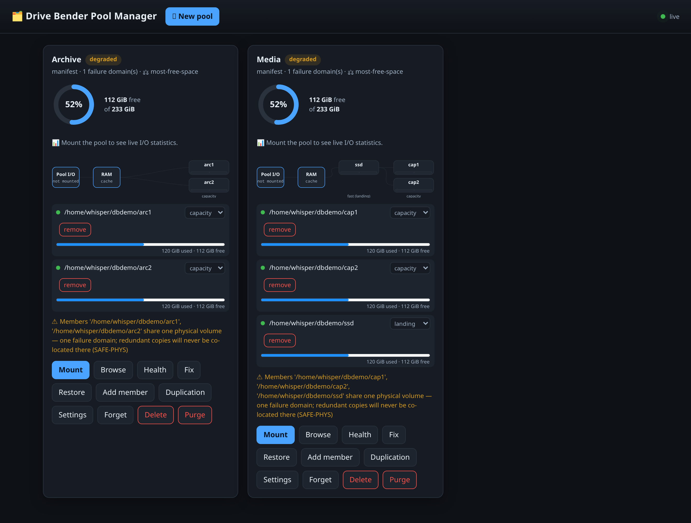
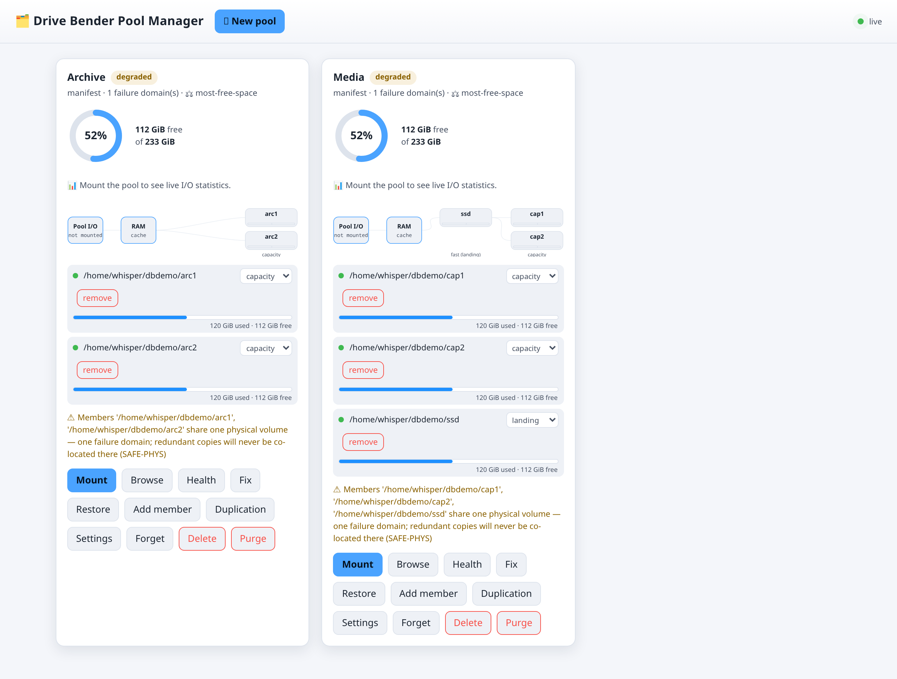
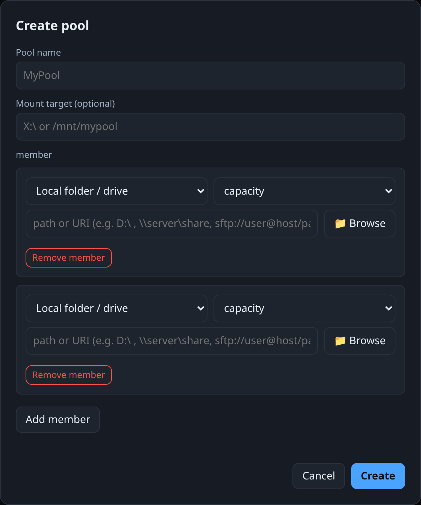
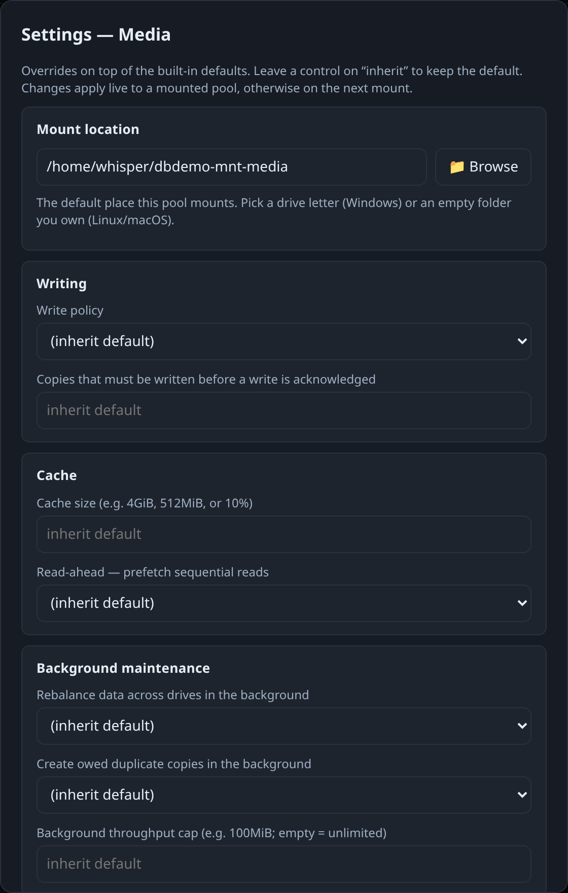

# 🗂️ DriveBenderUtility

[](https://github.com/Hawkynt/DriveBenderUtility/blob/main/LICENSE)
[](https://github.com/Hawkynt/DriveBenderUtility)

[](https://github.com/Hawkynt/DriveBenderUtility/actions/workflows/ci.yml)


[](https://github.com/Hawkynt/DriveBenderUtility/stargazers)
[](https://github.com/Hawkynt/DriveBenderUtility/network/members)
[](https://github.com/Hawkynt/DriveBenderUtility/issues)


[](https://github.com/Hawkynt/DriveBenderUtility/releases/latest)
[](https://github.com/Hawkynt/DriveBenderUtility/releases)
[](https://github.com/Hawkynt/DriveBenderUtility/releases)

> The #1 Spot for dealing with [DriveBender](https://en.wikipedia.org/wiki/Non-standard_RAID_levels#Drive_Extender) pools outside [DriveBender](https://www.division-m.com/drivebender/).

**DriveBenderUtility** is a comprehensive C# solution for managing Drive Bender
storage pools — and mounting them as a live, read/write filesystem on Windows
(WinFsp/Dokan) and Linux (FUSE). Pools are defined by a portable JSON manifest
over arbitrary members: local drives, subfolders, UNC shares, and remote/cloud
endpoints (FTP/SFTP/WebDAV/S3/Azure/Dropbox/OneDrive/Google/Box/Yandex/HiDrive).
It adds a tiered
RAM→SSD→capacity write cascade, configurable duplication and write policies,
crash-safe journaling, bit-rot/SMART health checks with correction, and both a
CLI (`dbmount`) and an animated live web/desktop dashboard. Jump to
[**Quick Start**](#-quick-start) to create and mount your first pool.



> The animated live dashboard (`dbmount serve`, and the desktop app) — one card per
> pool with capacity donuts, a RAM→fast→capacity tier topology, per-member usage
> and health. See more in [**Screenshots**](#-screenshots).

## 🏗️ Project Structure

The solution is organized into the following projects:

### 📚 DriveBender.Core
Core library containing all Drive Bender functionality:
- **Pool Management**: Create, delete, and manage storage pools
- **Drive Operations**: Add, remove, and replace drives with intelligent data migration
- **Duplication Manager**: Control file duplication with multiple shadow copy support
- **Integrity Checker**: Comprehensive file integrity verification and repair
- **Semantic Data Types**: Type-safe wrappers for paths, sizes, and configuration

### 💻 DriveBender.Console  
Command-line interface covering the full pool lifecycle:
- Pool creation and deletion
- Drive management operations
- Duplication control
- Integrity checking and repair
- Dry-run mode for safe operations

### 🖥️ DriveBender.App *(net10.0)*
The desktop GUI is a thin cross-platform **WebView shell** (Photino → WebView2 on
Windows, WebKitGTK on Linux) that launches `dbmount serve` and hosts the same web
UI the daemon serves — so the desktop app and a browser are the *same* animated,
live dashboard. (The legacy WPF `DriveBender.UI` has been retired.)

### 🧪 DriveBender.Tests
Comprehensive test suite categorized as:
- **Unit Tests**: Core functionality testing (HappyPath, EdgeCase, Exception)
- **Integration Tests**: Cross-component testing
- **End-to-End Tests**: Complete workflow validation
- **Performance Tests**: Scalability and speed verification
- **Regression Tests**: Backwards compatibility and bug prevention

### ⚙️ DriveBender.Vfs *(net10.0)*
Platform-agnostic VFS/I/O engine towards live pool mounting
(see `docs/PRD-PoolMount-Driver.md`):
- **Pool manifests**: pools defined over arbitrary member paths — drive roots,
  subfolders, UNC shares — in a portable, versioned JSON manifest stored
  redundantly (machine registry + a mirror on every member)
- **Member self-identification**: members carry a `.drivebenderutility/member.json`
  marker and are resolved by marker content, so drive-letter changes are harmless
- **Native pool adapter**: the classic drive scan synthesizes a *virtual manifest*,
  so native pools flow through the identical code path and can be *adopted*
  into editable manifests in place
- **Physical failure domains**: placement identity is the underlying volume
  (subfolder members on one disk are one domain), with de-duplicated free-space
  accounting and `reserveBytes`
- **Byte-range I/O abstraction** (`IVolumeIO`) with local backend and atomic
  temp-and-rename publication, plus whole-file remote backends
- **Hierarchical configuration** (built-in defaults → global → pool → folder
  globs) with strict validation: duplication-aware ack floors, journal and fsync
  safety switches that cannot be disabled, and a never-over-committed RAM ceiling
  for cache instances

### 🌐 DriveBender.Backends *(net10.0)*
Members can be far more than local drives — any of these joins a pool as a
whole-file capacity tier. The stores live in the standalone, provider-neutral
**[`Hawkynt.CloudStorage`](Hawkynt.CloudStorage)** library (published to NuGet);
`DriveBender.Backends` adapts them to the engine's `IVolumeIO` via
`CloudStoreAdapter`:

| Scheme | Backend | Client |
|---|---|---|
| `file` / `unc` | local drive, subfolder, UNC share | .NET |
| `ftp` / `ftps` | FTP / FTPS | FluentFTP |
| `sftp` / `ssh` | SFTP (password or private key) | SSH.NET |
| `webdav` / `webdavs` / `dav` / `davs` | WebDAV | WebDav.Client |
| `s3` | Amazon S3 & S3-compatible (MinIO…) | AWSSDK.S3 |
| `azblob` / `azfile` | Azure Blob / Azure Files | Azure.Storage.* |
| `dropbox` | Dropbox | Dropbox.Api |
| `onedrive` | Microsoft OneDrive | Microsoft.Graph |
| `gdrive` / `gcs` | Google Drive / Cloud Storage | Google.Apis.* |
| `box` | Box | REST |
| `yandex` | Yandex Disk | REST |
| `hidrive` | Strato HiDrive | REST |

OAuth providers (`gdrive`, `onedrive`, `dropbox`, `box`, `yandex`, `hidrive`)
use **bring-your-own client-id OAuth2** — a loopback-redirect + PKCE browser
login via `dbmount credential-login`, with automatic access-token refresh so a
long-lived pool never relies on a static token. (Box, Yandex Disk and HiDrive
are wired up but not yet integration-tested against live accounts.)

Remote members are capability-honest: no atomic rename and no durable flush, so
the engine journals around the gaps and never counts a remote copy toward
`minCopiesBeforeAck` (`SAFE-REMOTE`). Secrets live only in the OS credential
store (Windows Credential Manager, or an owner-only file fallback) and are
referenced from the manifest by `cred-ref:<name>` handle (`SEC-CRED`).

### 🚀 DriveBender.Mount *(net10.0 / net10.0-windows, `dbmount`)*
CLI/daemon entry point for manifest pools:
- `dbmount pool create|import|export|list|add-member|remove-member|adopt|repair-manifest`
  — members may be drive roots, subfolders, UNC shares, or any remote URI above
- `dbmount credential set <name>` / `remove` — store remote secrets (read from a
  hidden prompt or stdin, never shell history)
- `dbmount mount --manifest <file|poolId|name> [--target X:\|/mnt/pool] [--read-only]`
  — mounts the pool as a live filesystem: **WinFsp** or **Dokan** on Windows,
  **FUSE** on Linux. Crash recovery replays the journal before serving, health
  warnings surface up front, background workers (owed-copy sync, landing-zone
  drain, trash maintenance) pump while mounted, and unmount flushes all dirty
  state
- Non-destructive by contract: pre-existing folder content is never absorbed
  without `--force`, and folders owned by another pool are always refused

### 🪟 DriveBender.Mount.Windows *(net10.0-windows)*
The Windows platform adapters — thin callback translations over the engine's
`IPoolFileSystem` contract (no pool logic in the adapter, `NFR-PORT`):
- **WinFsp** (`winfsp.net`) — preferred, richer semantics
- **Dokan** (`dokan-dotnet`, LGPL) — automatic fallback so no specific driver
  install is forced; `dbmount` picks whichever is present

### 🐧 DriveBender.Mount.Linux *(net10.0)*
The **FUSE** platform adapter (`LTRData.FuseDotNet`, LGPL) plus a
`mount.drivebender` fstab helper and a `drivebender-pool@.service` systemd
template, so a manifest mounts natively at boot:

```fstab
/etc/drivebenderutility/pools/media.json  /mnt/media  fuse.drivebender  defaults,_netdev  0 0
```

### 🖥️ DriveBender.App *(net10.0)* & the web UI
The management daemon `dbmount serve` hosts a **dependency-free animated web
dashboard** (127.0.0.1, per-session token): live capacity donuts, cache-hit and
dirty meters, a hit-rate sparkline, a RAM→fast→capacity **tier topology with
animated flow lines**, per-member health tiles, and health/fix/restore actions,
fed at 1 Hz over Server-Sent Events. `DriveBender.App` is the cross-platform
desktop shell that hosts that same page in a native WebView.

### 🧪 DriveBender.Vfs.Tests *(net10.0)*
Headless engine suite: the whole VFS engine runs against in-memory fakes
(`FakeVolumeIO`, `FakeHostEnvironment`) including fault injection — power loss,
no-space, torn writes, offline members — so every safety invariant is testable
without a real pool.

## ✨ Features

### 🔧 Pool Management
- ✅ Create new storage pools with multiple drives
- ✅ Delete existing pools with data preservation options
- ✅ Forget a pool (remove from this machine's list, keep data + on-disk markers)
- ✅ Recover an orphaned pool from a member folder's manifest mirror
- ✅ Take a foreign-claimed folder over for a new pool (explicit consent)
- ✅ Add drives to existing pools with automatic balancing
- ✅ Remove drives with intelligent data migration
- ✅ Replace drives with seamless data transfer
- ✅ Space checking with user warnings

### 🚀 Write & read pipeline
- ✅ Staged writes: in-progress files live under a hidden temp name and only the atomic
  temp→final rename — the last action before the journal releases — makes them appear;
  a crash mid-write leaves no half-written file (fsync publishes early)
- ✅ Striped acks: with a relaxed ack quorum, consecutive blocks rotate across storages
  while the journal-backed owed-sync converges every copy in the background
- ✅ Parallel mirrored writes, parallel mirror-split reads (different offsets from
  different storages at once), per-block read failover, pooled positional I/O handles,
  background read-ahead

### 💾 Advanced Duplication
- ✅ Enable/disable duplication on folders
- ✅ Support for multiple shadow copies (beyond standard 2-copy limit)
- ✅ Configurable duplication levels (0-10 copies)
- ✅ Automatic shadow copy creation across volumes
- ✅ Smart duplication based on file importance

### 🔍 File Integrity & Repair
- ✅ Comprehensive integrity checking with 8 issue types:
  - Missing primary files
  - Missing shadow copies
  - Corrupted files
  - Orphaned shadow copies
  - Size mismatches
  - Timestamp inconsistencies
  - Permission issues
  - Duplicate primaries
- ✅ Automated repair with backup creation
- ✅ Dry-run mode for safe testing
- ✅ Deep scan capabilities
- ✅ Batch repair operations

### 🛡️ Safety Features
- ✅ Dry-run mode (enabled by default)
- ✅ Automatic backups before repairs
- ✅ Space validation before operations
- ✅ User prompts for destructive actions
- ✅ Comprehensive logging and error handling

### 🔒 Type Safety
- ✅ Semantic data types (PoolName, DrivePath, FolderPath, ByteSize, DuplicationLevel)
- ✅ Input validation and sanitization
- ✅ Compile-time safety for critical operations

## 📸 Screenshots

The GUI is a dependency-free web dashboard served by `dbmount serve` (and hosted
verbatim in the desktop app) — theme-aware, so it follows your OS light/dark
preference:

| Live dashboard (dark) | Live dashboard (light) |
|---|---|
|  |  |

| Create a pool | Pool settings |
|---|---|
|  |  |

- **Dashboard** — one card per pool: a capacity donut, the RAM→fast→capacity
  tier topology with animated flow lines, per-member usage bars and health, and
  the full lifecycle actions (mount, browse, health/fix, duplication, settings…).
- **Create a pool** — stack up members (local folder/drive, UNC, or any remote
  URI) with a per-member role and a folder browser; no JSON required.
- **Settings** — every pool knob as a labelled control (mount location, write
  policy, cache, background maintenance…), with an advanced JSON escape hatch.

## 📦 Getting Started

### Prerequisites

- **Build:** [.NET SDK 10](https://dotnet.microsoft.com/download). The engine,
  backends, `dbmount` and the app are `net10.0`; `DriveBender.Core` also targets
  `net47`/`netstandard2.0`. (Nothing needs Drive Bender installed — native pools
  are auto-discovered if present.)
- **To mount on Windows:** [**WinFsp**](https://winfsp.dev) *or*
  [**Dokan**](https://dokan-dev.github.io) — `dbmount` uses whichever is present
  (WinFsp preferred, Dokan is the no-extra-install fallback). *Installing* the
  driver needs admin (the app/UI can do it for you); *mounting* does not — mount
  as your normal user so the drive is visible in your own Explorer session.
- **To mount on Linux:** `fuse3` (`/dev/fuse`) — e.g. `sudo apt install fuse3`.
- **Remote/cloud members** need nothing extra; the SDKs are bundled.

### 🔨 Build

```bash
dotnet build DriveBender.sln -c Release
```

That produces `dbmount` (the CLI/daemon, `DriveBender.Mount/bin/Release/...`) and
`DriveBender.App` (the desktop shell). To run `dbmount` directly during
development, use `dotnet <path>/dbmount.dll <args>`; a published build gives a
plain `dbmount` executable. The examples below write `dbmount`.

### 🧪 Tests

```bash
dotnet test DriveBender.Vfs.Tests/DriveBender.Vfs.Tests.csproj   # the VFS engine (headless)
dotnet test DriveBender.Tests/DriveBender.Tests.csproj           # legacy Core suite
dotnet test DriveBender.Vfs.Tests/DriveBender.Vfs.Tests.csproj --filter "TestCategory=Unit"
```

## 🚀 Quick Start

A **pool** is defined by a portable JSON *manifest* — a set of member folders
(local drives/subfolders, UNC shares, or remote endpoints) plus tuning. You
create it once, then mount it as a live drive.

### 1. Create a pool

```bash
# two local members, duplicated data mounted at X:\ (Windows) …
dbmount pool create --name MyPool --member "D:\" --member "E:\" --mount "X:\"

# … or on Linux, mounted at a directory
dbmount pool create --name MyPool --member /mnt/disk1 --member /mnt/disk2 --mount /mnt/mypool

# an SSD landing zone (fast tier) plus capacity drives
dbmount pool create --name Media --landing "F:\ssd" --member "G:\" --member "H:\" --mount "M:\"

dbmount pool list          # what's discovered (manifest pools + native scan)
dbmount pool export MyPool # print the manifest JSON
```

Creating a pool never destroys existing folder contents without `--force`, and a
folder already owned by another pool is always refused.

### 2. Mount it

```bash
# Windows (WinFsp or Dokan must be installed; run as your normal user — NOT elevated, or the
# drive lands in a different session than Explorer and won't be visible)
dbmount mount --manifest MyPool            # mounts at the manifest's target, or pass --target Y:\
dbmount status                             # what's mounted right now
dbmount unmount X:\                        # clean unmount (flushes dirty data); or Ctrl+C the mount

# Linux
dbmount mount --manifest MyPool --target /mnt/mypool
fusermount3 -u /mnt/mypool                 # or: dbmount unmount /mnt/mypool
```

Now use `X:\` (or `/mnt/mypool`) from Explorer / any app — reads, writes,
rename, delete all work, with duplication, tiering and balancing handled
underneath.

**Mount automatically at boot / login:**

```bash
# Windows service (mounts before login)
dbmount install-service --manifest MyPool --target X:\
# Windows Explorer: register a right-click "mount" for *.dbpool.json manifests
dbmount register-shell

# Linux: install the systemd unit + mount.drivebender fstab helper (run with sudo)
dbmount install-systemd --manifest MyPool
systemctl enable --now drivebender-pool@MyPool.service
#   …or add to /etc/fstab:
#   /etc/drivebenderutility/pools/MyPool.json  /mnt/mypool  fuse.drivebender  defaults,_netdev  0 0
```

### 3. Remote & cloud members

Store the secret once (it goes to the OS credential store, never the manifest),
then reference it by handle:

```bash
# password / key based (FTP, SFTP, WebDAV, S3, Azure…)
dbmount credential-set MyPool-nas --user backup      # prompts for the secret (hidden)
dbmount pool add-member MyPool --member "sftp://backup@nas.local/pool" --credential MyPool-nas

# OAuth providers (Google, OneDrive, Dropbox, Box, Yandex, HiDrive) — browser login
# with your own registered client id (loopback + PKCE, auto-refresh)
dbmount credential-login MyPool-gdrive --provider google --client-id <your-id> --client-secret <your-secret>
dbmount pool add-member MyPool --member "gdrive://backups" --credential MyPool-gdrive
```

Supported schemes: `file`/`unc`, `ftp`/`ftps`, `sftp`, `webdav`/`webdavs`, `s3`,
`azblob`, `azfile`, `dropbox`, `onedrive`, `gdrive`, `gcs`, `box`, `yandex`,
`hidrive` (see the backend table above for the secret format each expects).

### 4. The GUI — web dashboard & desktop app

```bash
dbmount serve --open      # animated live dashboard at http://127.0.0.1:9723 (token-gated)
```

The page shows every pool with live capacity donuts, cache-hit/dirty and
cache-occupancy meters, a hit-rate history, and a **live flow map** — pool I/O →
RAM cache → fast tier → capacity storage — where **data blocks fly along curves**
as reads, writes, drains and duplications actually happen, with each storage's
measured latency shown in its node; updated once a second while pools are
mounted. With `placement.autoLandingZone` enabled, the **landing zone follows
the measured-fastest drive automatically** (hysteresis + cooldown prevent
flapping; a slow or busy drive gets demoted live). From the same page you can run the
**entire lifecycle**: create a pool (pick local folders with a built-in **folder
browser**, or add remote members whose **credentials are collected by a
scheme-aware dialog** — user/password for FTP·WebDAV, password *or* private key
for SFTP, access/secret keys for S3, account key for Azure, token for
Dropbox·OneDrive, service-account JSON for Google — stored under a reference the
manifest never inlines), mount / unmount, add or remove members, set
**duplication** (copies to keep — pool-wide or per folder/file glob; copies land
on independent physical disks by default, SAFE-PHYS, with an opt-in to also keep
copies on the same disk for bit-rot protection when no independent disk is free),
edit **all pool settings** via a validated JSON editor, remove- and replace-media,
**browse the pool** with one column per storage showing exactly where every
file/folder lives (✅ primary · 🔁 shadow · ❌ absent), run a **problem scan**
with a full report (under-duplicated files, integrity issues, per-device SMART)
plus one-click fix, restore, **forget** a pool (drop it from this machine's list
while leaving its data and on-disk markers intact, so it can be re-imported or
recovered later), and delete (keep data) or purge (wipe data, guarded by a
name-confirmation). If a chosen member folder is still claimed by another —
possibly forgotten or otherwise invisible — pool, the UI offers to **restore**
that pool from the manifest copy left in the folder, or **take the folder over**
for the new one, instead of failing outright. The **desktop app**
(`DriveBender.App`) is the same page in a native window — it launches the daemon
for you, so web and desktop are identical.

### 5. Health & media maintenance

```bash
dbmount pool health MyPool               # SMART, temperature, bit-rot, missing copies
dbmount pool health MyPool --fix         # repair bit-rot, resolve conflicts, restore duplication
dbmount pool restore MyPool              # bring every file back to its duplication level

dbmount pool remove-media MyPool --member "E:\"                 # scatter its data, then drop it
dbmount pool replace-media MyPool --old "D:\" --new "K:\newdisk"  # migrate to a replacement disk
```

Run `dbmount --help` (or `dbmount <verb> --help`) for the full option list.

## 🔧 Configuration

Tuning lives in the manifest's `defaults` block (per pool) or a machine-wide
`config.json` under the config root (`%ProgramData%\DriveBenderUtility` on
Windows, `/etc/drivebenderutility` or `~/.config/drivebenderutility` on Linux).
Values resolve built-in defaults → global file → pool → per-folder glob. A few
common knobs:

```jsonc
{
  "duplication": 2,                       // total copies kept of each file
  "write": {
    "policy": "write-back",               // write-through | write-back | deferred | performance
    "minCopiesBeforeAck": 2               // durable copies required before a write is acknowledged
  },
  "resilience": {
    "onMemberLoss": "retain-metadata"     // keep showing metadata when a drive is pulled,
                                          //   or "discard-inaccessible" to drop unreachable entries
  },
  "trash": { "enabled": true, "retention": "7d" },   // recoverable deletes
  "folders": {
    "Documents/**": { "write": { "policy": "write-through" }, "duplication": 3 }
  }
}
```

Config is validated on load and can be reloaded live without unmounting. See
`docs/PRD-PoolMount-Driver.md` §8 for the complete schema.

> **Legacy native pools:** the older `DriveBender.Console` still manages
> Division-M-format native pools directly (`create`, `add-drive`,
> `enable-duplication`, `check`, `repair`, `rebalance` — see
> `DriveBender.Console/CommandLineOptions.cs`). New work should prefer manifest
> pools via `dbmount`, which can also *adopt* a discovered native pool
> (`dbmount pool adopt <name>`) into an editable manifest without moving data.

## 📊 Architecture & Design

### Core Components

```
DriveBender.Core/
├── PoolManager.cs          # Pool lifecycle management
├── DuplicationManager.cs   # Shadow copy control
├── IntegrityChecker.cs     # File integrity verification
├── DataTypes.cs           # Semantic type definitions
└── DriveBender.cs         # Original Drive Bender interface
```

### Design Patterns
- **Factory Pattern**: Pool and volume creation
- **Strategy Pattern**: Different integrity check strategies
- **Observer Pattern**: Progress reporting during operations
- **Command Pattern**: CLI command structure
- **Repository Pattern**: Data access abstraction

### Error Handling Strategy
- **Graceful Degradation**: Continue processing despite individual failures
- **Comprehensive Logging**: All operations logged with context
- **User Feedback**: Clear error messages with suggested actions
- **Recovery Options**: Multiple repair strategies for different issue types

## 🤝 Contributing

We welcome contributions! Here's how to get started:

### Development Setup
```bash
# Clone the repository
git clone https://github.com/Hawkynt/DriveBenderUtility.git
cd DriveBenderUtility

# Build the solution
dotnet build DriveBender.sln -c Release

# Run tests to ensure everything works
dotnet test DriveBender.Vfs.Tests/DriveBender.Vfs.Tests.csproj
dotnet test DriveBender.Tests/DriveBender.Tests.csproj
```

### Contribution Guidelines
1. **Fork** the repository
2. **Create** a feature branch (`git checkout -b feature/amazing-feature`)
3. **Add tests** for new functionality
4. **Ensure** all tests pass
5. **Update** documentation as needed
6. **Commit** changes (`git commit -m 'Add amazing feature'`)
7. **Push** to branch (`git push origin feature/amazing-feature`)
8. **Create** a Pull Request

### Code Standards
- Follow existing C# conventions
- Add XML documentation for public APIs
- Include unit tests for new features
- Update README for significant changes
- Use semantic data types for type safety

### Testing Requirements
- **Unit Tests**: Required for all new core functionality
- **Integration Tests**: Required for cross-component features  
- **Performance Tests**: Required for operations handling large datasets
- **Regression Tests**: Add tests for bug fixes

## 📈 Performance Considerations

### Scalability Metrics
- **Small Pools** (< 1TB): Operations complete in seconds
- **Medium Pools** (1-10TB): Operations complete in minutes
- **Large Pools** (10TB+): Operations may take hours but provide progress feedback

### Memory Usage
- **Core Library**: < 50MB baseline memory usage
- **GUI Application**: < 200MB including UI framework
- **Batch Operations**: Memory usage scales linearly with file count

### Optimization Features
- **Lazy Loading**: Files and metadata loaded on-demand
- **Parallel Processing**: Multi-threaded integrity checking
- **Caching**: Intelligent caching of file metadata
- **Progress Reporting**: Real-time progress updates for long operations

## 🛡️ Security Considerations

### Permissions
- **Administrator Rights**: Required for drive operations
- **File System Access**: Full control over pool directories
- **Registry Access**: Reading Drive Bender configuration

### Data Protection
- **Backup Creation**: Automatic backups before destructive operations
- **Dry-Run Mode**: Preview changes before execution
- **Validation**: Input validation prevents path traversal attacks
- **Logging**: Comprehensive audit trail of all operations

## 🆘 Getting Help
- **Documentation**: This README and inline code documentation
- **Issues**: [GitHub Issues](https://github.com/Hawkynt/DriveBenderUtility/issues) for bugs and feature requests
- **Discussions**: [GitHub Discussions](https://github.com/Hawkynt/DriveBenderUtility/discussions) for questions and help

### Reporting Issues
When reporting issues, please include:
- Operating system and version
- .NET Framework version
- Drive Bender version
- Steps to reproduce the issue
- Expected vs actual behavior
- Log files (if available)

### Feature Requests
We welcome feature requests! Please:
- Check existing issues first
- Describe the use case
- Provide implementation suggestions if possible
- Consider contributing the feature yourself

## ❤️ Support

If this project saves you time or money, consider supporting its development:

[](https://github.com/sponsors/Hawkynt)
[](https://www.paypal.me/hawkynt)

## 📜 License

Licensed under LGPL-3.0-or-later — see [LICENSE](LICENSE).
